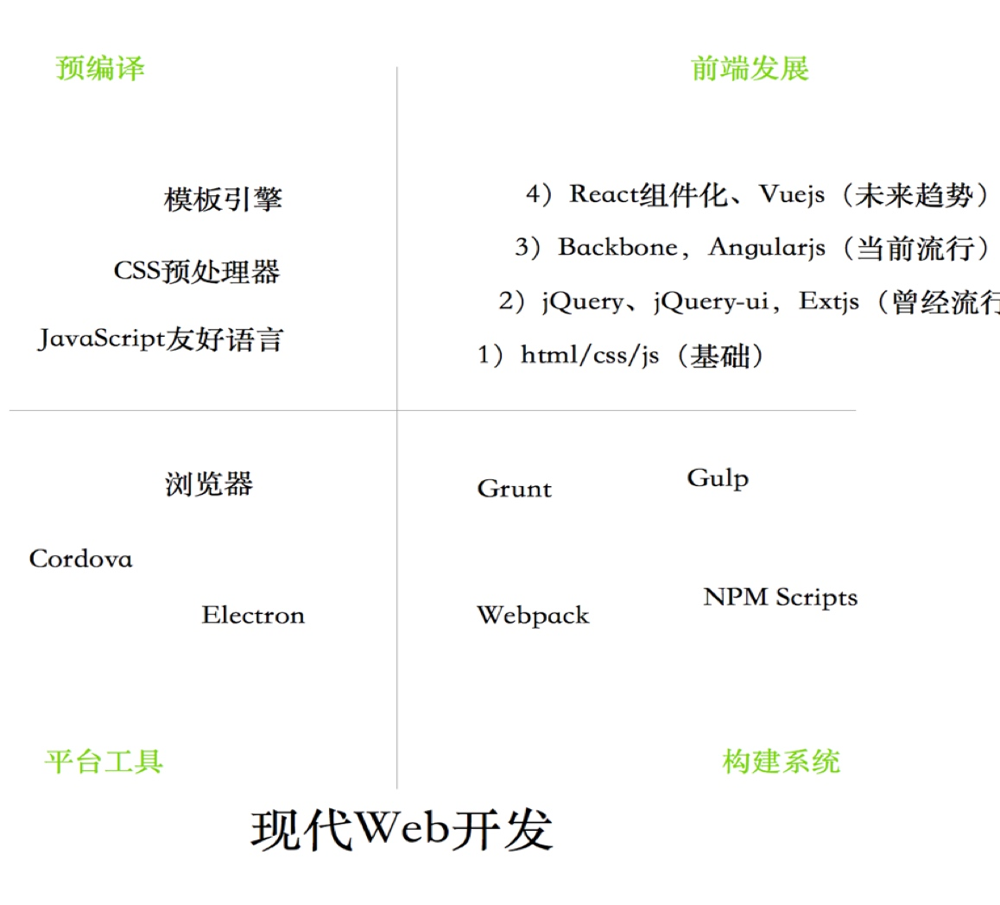
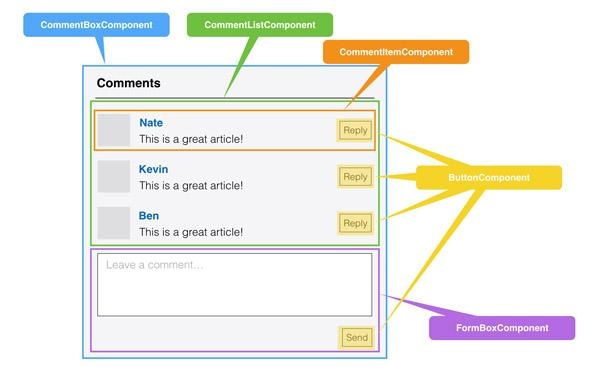
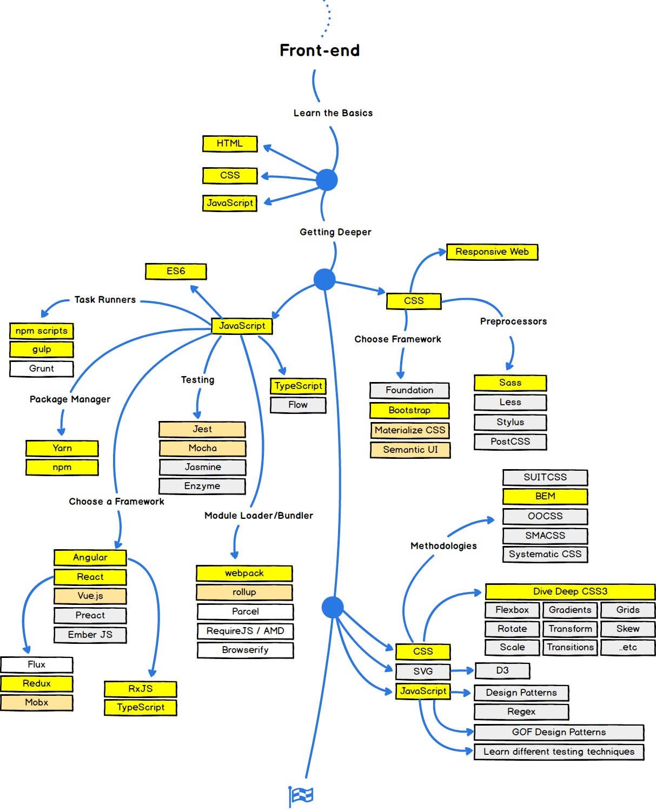
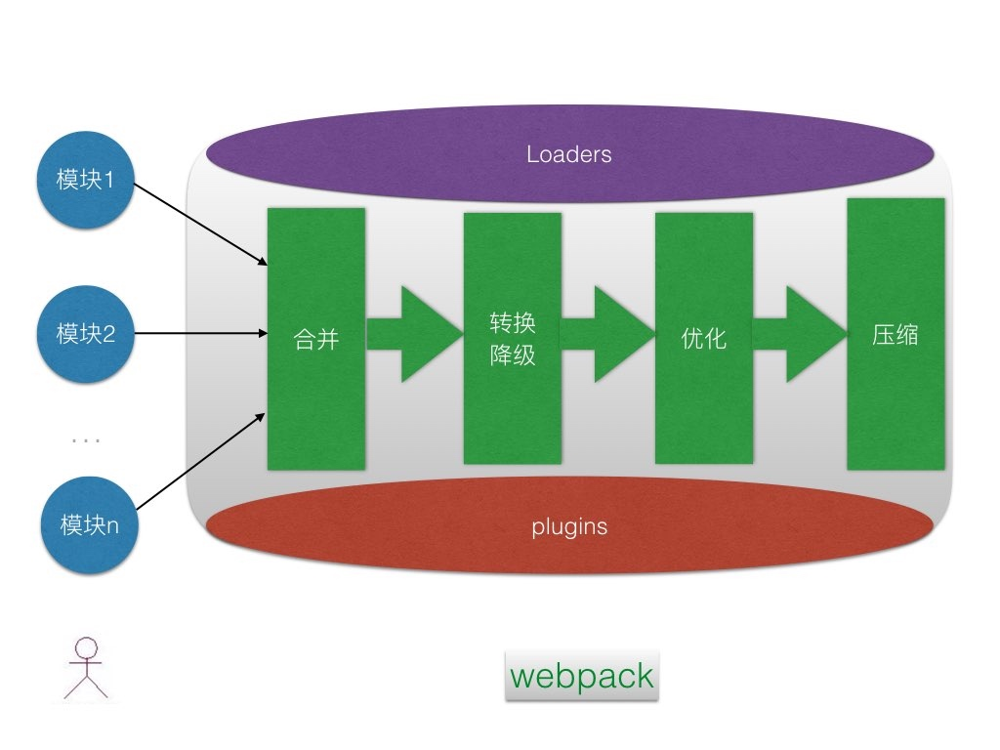

# 现代Web开发概览

前端可以说是最近几年开发领域里最火的部分，原因很多，最主要是开发方式的变更，以今时今日的眼光来看，称之为现代Web开发是不为过的。本章主要以Web开发的现代性为主题，阐述JavaScript在大前端开发中的地位，继而引出Node.js作为大前端基石的事实，作为本书的核心内容，我想它会更大家更有兴趣阅读本书的。

先给出笔者总结的现代Web开发的概览图，主要包含：前端发展4阶段，预编译、平台工具、构建系统。



## 前端四阶段

很多前端工程师会自黑，说自己是“切图仔”，这是因为前端开发工作主要是根据设计稿还原成Web页面，具体点讲就是切图，排版，算像素位置，是不太有技术含量的工作。在今天，前端已经发生了翻天覆地的变化，可是很多人还持老观点看待前端，这些可爱的前端工程师就自黑来反击。

下面让我们看一下现代前端进化的四个阶段。

### 原始阶段

在Web 2.0出现之前，大家的开发方式相对比较原始，能在浏览器上运行的只有html／js／css，只能是有什么用什么。在那个时代，开发的人很少，也没有更多更好的工具出现，如果说非要算的话，Adobe的网页三剑客（Dreamweaver，Fireworks，Flash）和微软的Frontpage可能还有人记得。

- 那时，会开发个网页也是非常赚钱的，甚至车接车送（互联网泡沫破碎之前）
- 那时，布局以table为主，div + css还没有普及
- 那时，flash还是主流，js还只是做点简单表单校验
- 那时，很少有人能手写代码，Dreamweaver（简称DW）用的非常多，根本无编码规范可言，更别谈优化了

用刀耕火种来形容并不过分，是非常原始的阶段，主要技术：html／js／css。

### 模块化阶段

Web2.0是相对Web1.0（2003年以前的互联网模式）的新的一类互联网应用的统称，是一次从核心内容到外部应用的革命。由Web1.0单纯通过网络浏览器浏览html网页模式向内容更丰富、联系性更强、工具性更强的Web2.0互联网模式的发展已经成为互联网新的发展趋势。

Web2.0是以 Flickr、Craigslist、Linkedin、Tribes、Ryze、 Friendster、Del.icio.us、43Things.com等网站为代表，以Blog、TAG、SNS、RSS、wiki等应用为核心，依据六度分隔、xml、ajax等新理论和技术实现的互联网新一代模式。

Web2.0最主要特征是Ajax的出现，彻底改变了Web交互方式，能够让页面在无刷新的情况下进行更新，这在当时也是极大的改变，用户再也不用页面跳来跳去了。Web2.0概念出现的比较早，但落地大约在2005年之后，各种浏览器对于dom操作和ajax实现都不完全一样，为了兼容浏览器，伴随而来的是大量js库的衍生。从最早的Prototype.js、Dojo、Google Closure、Mootools和YUI，到最终一统江湖的jQuery，这些库极大的解放前端的生产力，让开发更专注于业务实现。

```js
<script src="//code.jquery.com/jquery-3.2.1.min.js"></script>
<script type="text/javascript">
   $(document).ready(function(){
       //自身要写的jQuery代码
       $('div').find('h3').eq(2).html('Hello');  
   });
</script>
```

但还有2个问题没法解决，一是组件化，二是浏览器对样式的兼容。先说组件化，一直都没有很好的解决方案，由于面向对象思想的先手优势，使得大家都将面向对象当成良药，于是衍生出了很多ui框架都是基于OO思想，最著名的大概就是Extjs了，在企业开发领域还是非常受欢迎的。但是受限于js的基于对象的限制，Ext最终自己实现了一个Ext-core的扩展机制才使得很多高级面向对象特性得以实现。后面很多类似的框架也都是这样的思路，如果说能够分庭抗礼的，可能就是基于jQuery插件的各种ui框架了，比如jQuery EasyUI等。中间还流行过富客户端应用开发RIA（Rich Internet Application），知名的有JavaFX、Flex和SilverLight，但也都只是昙花一现，没有太成功。

浏览器对样式的兼容一直都没有比较好的解决方案，直到移动端各种phone、pad兴起，导致多尺寸屏幕适配问题难于适配，所以出现了响应式布局的概念，其核心是通过media query（媒介查询）来实现。

```css
/* iPad [portrait + landscape] */
@media only screen and (min-device-width: 768px) and (max-device-width: 1024px) {
	.selector-01 { margin: 10px; }
	.selector-02 { margin: 10px; }
	.selector-03 { margin: 10px; }
}

/* iPhone [portrait + landscape] */
@media only screen and (max-device-width: 480px) {
	.selector-01 { margin: 10px; }
	.selector-02 { margin: 10px; }
  .selector-03 { margin: 10px; }
}
```

但屏幕尺寸那么多，适配起来也非易事，于是基于响应式布局的twitter开源的BootStrap框架火起来了，几乎是兼容多端适配的必选方案，它提供了优雅的HTML和CSS规范，它本身是由动态CSS语言预处理器Less写成。BootStrap的3个特性。

- 预处理脚本，便于定制
- 一个框架、多种设备，完美适配
- 特性齐全

尤其是Bootstrap提供了一套响应式、移动设备优先的流式栅格系统，随着屏幕或视口（viewport）尺寸的增加，系统会自动分为最多12列。它包含了易于使用的预定义类，还有强大的mixin 用于生成更具语义的布局。

在这个阶段，jQuery等前端库抹平了浏览器上js的兼容性，BootStrap抹平了多端适配的兼容性，而Ext则通过自身扩展OO机制，达到了组件上能在OO级别最好的适配。无论如何，前端还只是前端，除了Ext外的OO特性外，你很难看到任何后端对前端的影响。

是的，没错，这最多只是封装的尝试阶段，此时的前端还没有太多编程性可言，听到的最多的就是对浏览器的抱怨。

模块化阶段，以库为主，著名的有jQuery，Exitjs，BootStrap等，非常流行。这些库现在依然有很多应用场景，只是相比React/Vue等组件化框架会有种隔代的感觉。

### 崛起混战阶段

开源界有一个低调的传奇人物Jeremy Ashkenas，他是CoffeeScript、Underscore和Backbone的作者。出于对JS特性的憎恨，他写了借鉴自Ruby语法的间接性的CoffeeScript，很了不起。对于一些通用性库，他封装了Underscore这个早期著名的函数库。笔者以为他最了不起的不是这2个项目，而是Backbone，前端界第一个知名的MVC框架。MVC模式最早出现在Java的GUI开发中，但很可惜有心栽花花不开，并没有成功。但在Java Web开发领域却大放异彩，成为Web开发领域事实上的标准，几乎后面的所有Web框架都遵守MVC模式。所以，Backbone的尝试，开启了前端开发借鉴后端的先河。

下面是jQuery和Backbone结合的例子

```js
<script type="text/javascript">
  var AppView = Backbone.View.extend({
     events: {
         // the element IS the link, you don't have to specify its id there
         'click': 'createNew'
     },
     //CREATE
     createNew: function(){
         alert('yea');
     }
 });

 $(document).ready(function() {
   // attach the view to the existing a element
   var app_view = new AppView({
     el: '#new'
   });
 });
</script>

<body>
  <a href="#new" id="new">new</a>
</body>
```

最开始的版本里数据流是单项，所以代码写起来是冗长的，即使是基于Marionette这样的框架写起来也还是比较麻烦，目前看貌似除了Ruby on Rails的开发们用Backbone比较多外，其他用backbone开发应用的并不算多。

另外一个知名案例是AngularJS，一款由Google维护的开源的JavaScript MV*（MVW、MVVM、MVC）框架，这样必须要讲一下mvvm，即数据双向绑定，以前mvc时候，通过model作为传递数据的载体，但model上的变动无法主动通知view和controller，那怎么办呢？将model拆成viewmodel，这其实就上双向绑定的核心原理。除了mvvm外，angular还增加ioc（控制反转）概念，这是借鉴后端的特性。另外，AngularJS还弥补了HTML在构建应用方面的不足，其通过使用标识符（directives）结构，来扩展Web应用中的HTML词汇，使开发者可以使用HTML来声明动态内容，从而使得Web开发和测试工作变得更加容易。

AngularJS最初由Miško Hevery和Adam Abrons于2009年开发，后来成为了Google公司的项目。2010年是一个转折点，当时Miško正参与Google Feedback的开发。他们使用GWT进行开发，比较郁闷的是，开发速度和项目的进展比较缓慢。随后，Miško将17K大小的基于GWT的应用程序使用JavaScript进行了重写，且代码只有1500行。这引起了很多人的重视，公司也开始资助他们全职开发AngularJS。

```html
<div ng-app="">
  <p>名字 : <input type="text" ng-model="name"></p>
  <h1>Hello {{name}}</h1>
</div>
```

当输入框里的内容变了，model里的name属性会自动被赋值，继而在h1标签里会显示变化后的name值。这一切简直太爽了。几乎每一个用过angularjs的人，都不想再使用jQuery了。

为了兼容ie低浏览器，angularjs的双向绑定代码做了很多脏检查，所以它的代码对于有洁癖的程序员是不能接受的，其实最不能接受的是低版本浏览器。比如Even You写了Vue的0.x版本，参照angularjs 1.x，使用Object.defineProperty()检测值改变来实现纯净版的双向绑定，彻底抛弃了ie9以下的版本。

从Backbone、Angular等框架开始，开启了前端真正意义的崛起阶段，类似于中国历史中的春秋战国时期，引入更多编程思想（尤其后端开发介入），主要是引入mvc／mvvm/ioc。再加上Node.js在工程化上的助力，形成了前端百花齐放，百家争鸣的局面，很混乱，但颇具启发意义，为后面的组件化阶段的形成做了非常多的沉淀。

### 组件化阶段

基于HTML的前端界面开发正变得越来越复杂，其本质问题基本都可以归结于如何将来自于服务器端或者用户输入的动态数据高效的反映到复杂的用户界面上，Facebook的React框架正是完全面向此问题的一个解决方案。按官网描述，其出发点为：用于开发数据不断变化的大型应用程序（Building large applications with data that changes over time）。相比传统型的前端开发，React开辟了一个相当另类的途径，实现了前端界面的高效率高性能开发。

首先，对于React，有一些认识误区，这里先总结一下：

- React不是一个完整的MVC框架，最多可以认为是MVC中的V（View），甚至React并不非常认可MVC开发模式
- 有人拿React和Web Component相提并论，但两者并不是完全的竞争关系，你完全可以用React去开发一个真正的Web Component
- React不是一个新的模板语言，JSX只是一个表象，没有JSX的React也能工作

重要事情说3遍：React 仅仅是个 view 层！组件化要点是虚拟DOM + JSX。

虚拟DOM(virtual-dom)不仅带来了简单的UI开发逻辑，同时也带来了组件化开发的思想，所谓组件，即封装起来的具有独立功能的UI部件。React推荐以组件的方式去重新思考UI构成，将UI上每一个功能相对独立的模块定义成组件，然后将小的组件通过组合或者嵌套的方式构成大的组件，最终完成整体UI的构建。例如，Facebook的instagram.com整站都采用了React来开发，整个页面就是一个大的组件，其中包含了嵌套的大量其它组件，大家有兴趣可以看下它背后的代码。

对于MVC开发模式来说，开发者将三者定义成不同的类，实现了视图、数据的分离。开发者更多的是从技术的角度来对UI进行拆分，实现松耦合。对于React而言，则完全是一个新的思路，开发者从功能的角度出发，将UI分成不同的组件，每个组件都独立封装。

在React中，你按照界面模块自然划分的方式来组织和编写你的代码，对于评论界面而言，整个UI是一个通过小组件构成的大组件，每个组件只关心自己部分的逻辑，彼此独立。



React认为一个组件应该具有如下特征：

1. 可组合（Composeable）：一个组件易于和其它组件一起使用，或者嵌套在另一个组件内部。如果一个组件内部创建了另一个组件，那么说父组件拥有（own）它创建的子组件，通过这个特性，一个复杂的UI可以拆分成多个简单的UI组件；
1. 可重用（Reusable）：每个组件都是具有独立功能的，它可以被使用在多个UI场景；
1. 可维护（Maintainable）：每个小的组件仅仅包含自身的逻辑，更容易被理解和维护；
1. 可测试（Testable）：因为每个组件都是独立的，那么对于各个组件分别测试显然要比对于整个UI进行测试容易的多。

在用React写组件的时候，通常会用到JSX语法，粗看上去，像是在JavaScript代码里直接写起了XML标签，实质上这只是一个语法糖，每一个XML标签都会被JSX转换工具转换成纯JavaScript代码，当然你想直接使用纯Javascript代码写也是可以的，只是利用JSX，组件的结构和组件之间的关系看上去更加清晰。模板而已，有或者无，或者其它写法都无所谓的。

想想，我们在Extjs时代的代码，处处都是对象。

```js
Ext.onReady(function () {
    Ext.create('Ext.Window', {
        title: 'Anchor layout',
        width: 400,
        height: 400,
        layout: 'anchor',
        plain: true,
        items: [
            Ext.create('Ext.panel.Panel', {
                title: 'panel1',
                height: 100,
                anchor: '-50',
                html: '高度等于100，宽度= 容器宽度-50'
            }),
            Ext.create('Ext.panel.Panel', {
                title: 'panel2',
                height: 100,
                anchor: '50%',
                html: '高度等于100，宽度=容器的宽度*50%'
            })
        ]

    }).show();
}); 
```

对比React写法

```js
var TabItem  = require('./tab_item.jsx');
var Tab      = require('./tab.jsx');

var callback = function(key){

}

React.render(
  <Tab tab_changed={callback}>
    <TabItem title="tab说明" current>
      <p>tab说明</p>
    </TabItem>
    <TabItem title="'特性'">
      特性
    </TabItem>
    <TabItem title="开源协议">
      开源协议
    </TabItem>
    <TabItem title="源码">
      源码
    </TabItem>
  </Tab>
  ,
  document.getElementById('wrap1')
);
```

对比一下，很明显React的做法要比Extjs好很多，这才是大家想要的组件化，而不是一堆对象组装复用。

React本身不支持双向绑定的，需要单独的插件才可以，它的props处理还比较原始，对于习惯Angular的人肯定希望是Angular + React能够合体，既有mvvm又有vdom，是不是想想就让人很开心，于是Vue.js就应运而生了。它不是一步到位的，而是先实现了mvvm，然后加入组件化功能，于是开始了自己的道路：“The Progressive JavaScript Framework”。

```html
<script src="http://static.runoob.com/assets/vue/1.0.11/vue.min.js"></script>
<div id="app">
  <ol>
    <!--
      Now we provide each todo-item with the todo object
      it's representing, so that its content can be dynamic.
      We also need to provide each component with a "key",
      which will be explained later.
    -->
    <todo-item
      v-for="item in groceryList"
      v-bind:todo="item"
      v-bind:key="item.id">
    </todo-item>
  </ol>
</div>

<script>
Vue.component('todo-item', {
  props: ['todo'],
  template: '<li>{{ todo.text }}</li>'
})
var app = new Vue({
  el: '#app',
  data: {
    groceryList: [
      { id: 0, text: 'Vegetables' },
      { id: 1, text: 'Cheese' },
      { id: 2, text: 'Whatever else humans are supposed to eat' }
    ]
  }
})
</script>
```

对于组件化来说，只是View的框架是远远不够的，于是各种路由（vue-router）、状态管理（vux）等组件也都慢慢丰富了。做到最后，其实就是框架+生态，搭好台子，剩下的就是让开发者专注写业务模块就好了，这点上说Vue做的确实很好。

组件化的出现不只是引爆了前端开发领域，对于移动端开发的影响也是非常重大的，比如很多公司采用react-native或weex开发移动应用，导致移动端开发人员比例骤降，只留几个原生开发，大部分功能由前端编写。对于移动端开发就2个选择，首选是转前端，可以兼顾组件和SDK插件，最差的做法是固守native，最终变成那个硕果仅存的会写SDK插件的人。

我们来想想一般的前端有什么技能？

- html
- css（兼容浏览器）
- js会点（可能更多的是会点jquery）
- ps切图
- firebug和chrome debuger会的人都不太多
- 用过几个框架，大部分人是仅仅会用
- 英语一般
- svn/git会一点

那么他们如果想在前端领域做的更深有哪些难点呢？

- 基础：oo，dp，命令，shell，构建等
- 编程思想上的理解（mvc、ioc，规约等）
- 区分概念
- 外围验收，如h5和hybird等
- 追赶趋势，如何学习新东西

现在来总结一下学习有2种，1是从头来，2是从某一种框架起

第一种学习下来，没个几年很难学通，第二种只会用框架，补齐概念和基础也比较费劲。总之，无论如何学习曲线都是比较陡峭的，那么如何来让入门的开发者快速学习到这些呢？

软件的精髓在应变，殊途同归，学会如何学习才是我们最重要的道。

- 积极的心态，做好适应变化的准备
- 找到属于自己的学习方式
- 如果有机会，改变或创新，贡献开源社区
 
给出Kamran Ahmed画的[前端入门路线图](https://github.com/kamranahmedse/developer-roadmap)，非常经典。 
 
 

## 移动端

以前叫互联网，但在2009年之后开始叫移动互联网，随着iPhone和各种安卓智能手机机的普及，使得移动开发慢慢的变成主流，甚至很多公司连pc业务都停掉，全力押宝移动端。这是可以理解的，确实移动设备已经深刻的影响了每个人的生活，那么在这样一个移动互联网时代，移动端开发也必然会变成关注焦点。从09年到现在可以明显的感觉其中的变化，这里会一一列出，希望能够对大家有所帮助。

### 原生时代 Native

移动端开发应该是从塞班开始的，不过那时候还不叫智能机，可惜塞班一代传奇没能延续，所以一般谈及移动开发指的是iOS、Android，WP（曾经微软的，但现在也基本没了），对于这些移动端操作系统上做app开发，可以这样理解，建立在操作系统之上的应用软件，在App里直接调用操作系统提供的sdk就好了。这和在浏览器支持html、js、css是一样，所以原始阶段都是直接调用SDK开发的。iOS使用objective-c开发，android使用java开发，这种原始的开发方式成为原生开发（Native）。

原生开发的优缺点都是非常明显的，首先看一下优点，它的实现是直接调用SDK接口，所以在执行效率上来说非常高，可以完成所有API支持的所有功能。优化也非常容易，对于系统Api进行hack也非常容易。但它的缺点也非常明显，首先一个app可能要覆盖iOS和Android二个平台，也就是说你至少需要一个iOS程序员和一个android程序员，毕竟开发的语言不通，几乎无法让一个人都做。这在成本上来说，至少是二份，而且养客户端的同学几乎没有其他地方可以复用，做客户端的懂前后端都不太多。

明显，对企业来说，这是很不划算的。

### 混搭解决方案 Hybrid

企业的本质是成本计算，那么一种很不划算的方案早晚是要玩完的。于是大家都将目光集中在h5上。原因很简单，h5跨了webview，让我们看到了曙光。所有前端都可以h5页面，复用现有开发，开发完成后将h5/js/css打包生成对应的app，一切看起来都是那么完美。

这是共性需求，在Adobe开放PhoneGap代码之后，大家都觉得一个新的时代来了，通过h5技术开发应用，然后通过phonegap打包生成各种平台上可以运行的app，比如ios下的ipa，android下的apk。打包的工作有phonegap来说，开发需要做的h5开发，当然h5也有无法实现的功能，比如发短信，打电话等，这时候就需要采用phonegap的插件机制来实现，调用iOS/Android sdk的封装，通过jsbridge作为桥梁，最终提供js接口。

很明显phonegap是非常成功的，后来adobe将phonegap捐赠给apache，由于adobe持有phonegap商标，所以apache只能将phonegap更名为cordova。时至今日，cordova已经非常成熟了，各种h5开源解决方案也非常成熟，无论是ui还是cordova插件也都非常丰富。对于前面讲的前端框架也有非常好的集成，比如著名的ionicframework就是基于angular + cordova实现的开箱即用的一站式框架，开发效率和运行效率都非常的好。

但h5开发也有缺点，复杂交互还是非常卡顿，尤其是带有动画交互的。受限于当时的硬件和网速，另外就是能够优化h5性能的高手也是极少的，所以很多公司都是那h5做demo，最后不得不使用native重写，比如Facebook，多么疼的领悟。

### 组件化过渡方案 rn／weex

前面我们讲到h5性能不满足，使用native开发又觉得成本不划算，那么有什么更好的做法呢？伴随react出现之后，facebook又推出了react-native（简称rn），它使用react语法，通过运行时编译，使用js和jsx编写组件，但实际调用的是native源码。虽然不是h5，但前端会写react，写rn就非常简单。所以组件化变成了移动端新的热点

诚然，react-native的出现是具有有里程碑意义的事件，移动端组件化的热潮开始了。很多公司，比如去哪儿网的移动端app就是基于rn开发，自己定制了qrn以及各种ui组件，整体来看效率还是相当不错的。

跟rn类似的是基于vue组件的weex，它是由alibaba开发的移动端组件化解决方案，在阿里双十一里起到至关重要的作用，也是整个阿里系热更新的标配解决方案。weex的性能比rn好一些，语法对vue开发者友好，而且更适合单页面类的开发，其产生就是为了解决活动类页面的痛点。在2017年weex已捐赠给apache组织，未来是一个非常的好的技术选型方案。

微信小程序从出来我就开始关注，并持续看好，web的研究无论是spa还是pwa，终究还是和native差一些。小程序作为中间过度方案是极好的，渲染效率非常棒，而且以微信的生态作为背书，持续看好。很多公司的也有类似的产品实现，最简单的方式就是包一层rn／weex。

无论是rn还是weex，给我们的感觉是前端组件写法，然后调用natie sdk呈现，这明显是是一个折中的方案，h5无法完成复杂交互，native开发又成本过高，所以移动组件化无疑是一个过渡过程。当下react/vue已成主流，所以统一开发方式，是降低成本一个非常重要的手段。

移动端组件化的出现直接导致移动端开发人员的职业生涯的改变。在2010年会写个button组件的人就敢开口要工资1万以上，这也间接导致后面移动端开发相关的培训异常火爆。其实，想想也正常，在那时候，随便在中关村的车库咖啡讲讲自己的想法，就有投资人争着抢着砸钱，而且是无条件的砸。在2015年10月，资本开始也不好过，慢慢的就回归理性了，所以移动端开发也慢慢变得不再吃香，随着移动端组件化的又让移动端的开发人员雪上加霜，大部分开发都是js来做，只是自定义功能才需要native参与，所以很多移动端开发都默默的转前端开发了。这最好的选择，同时兼顾移动端和前端开发的人毕竟是少数，对调优，功能都是非常有好处的。

### H5才是未来

从native开发到hybrid到移动端组件化，这些所有的折腾都是在成本和效率中平衡，但很明显h5和native才是2个极端。笔者一直都坚信，未来是h5的，原因有2，一是硬件越来越牛逼，廉价，内存不会成为限制条件，二是网络带宽越来越牛逼。这估计也是目前h5受限的2个主要点吧。

微信公众号时代，引入h5，以及手游，算是让h5火了一把，但整体来说开发体验并不好，一般大家只用h5写一些交互少、偏于展示层的东西。而完整的hybrid应用，还是要有一定比例的借助native来实现一些原生功能的。无论是h5虚拟化也好，还是各种折腾，比如cordova，react natvie也好，它们都是过渡状态，从native到h5的发展过程来看，它们都是限于条件妥协的产物。当然，在目前来看，想要取得好的效果，一个不错的选择而已。

最近几年，被h5冲击的native开发越来越惨淡（相比2010年到2014年），甚至有人说app已死，开发公众号h5就可以了。这是客观的某种事实，确实微信有用户基数，是比较好的入口，另外你需要的功能基本上都可以实现。而且成本上，相对要低一些。

可，它真的很完美么？不见得吧

- 1）跨平台是永远的痛，一般连iOS6+，Android 4+都很难兼顾，有时候讨厌的让人不禁想起ie6
- 2）各个浏览器，版本实现不一致，以存储为例，localstorage，sqlite，indexedb等，每个版本可能都不一定支持，又何谈通用性呢？混乱不是不能解决，成本问题
- 3）开发看着容易，但你很难找到好的开发人员。写的话大家差不多都可以，但谈到优化，大部分人都怂了，这其实也是目前h5效果不好的原因

在平衡时间和实现之间，有时我们忍了。。。这大概就是生活吧。开发不只有诗和远方，也有眼前的苟且。目前无数开拓者，前仆后继，都投入到这个坑里，无数的解决方案，框架，优化，每天都在产生。我们现在觉得前端发展无比迅速，其实很大比例是h5推动的，它已经是前端领域必不可少的组成部分。无论是vue 2， ng2，ionic2等都是比较优秀的，甚至基于weui都衍生出大把的框架。这是时代带给我们的，既是挑战，也是机遇。

再说说人的问题

- 传统的前端不会h5都不好意思说自己是前端，目前招聘最火就是前端了，面试是不可能不问h5相关问题的
- iOS和Android开发，如果不会h5，未来的出路会越来越窄，当下北京的iOS培训出来的都很难找工作（甚至有不要薪水蹭经验的）。对于那些在职的人来说，每天领导都在“算计”他们，要不hybrid？

h5就像前端开发里躲不开Node.js一样，再移动互联网时代，无论你是做什么的，你都绕不开h5。目前PWA对h5做了增强，尤其是缓存使用，使得曾经移动端能做的事儿也都能实现了，另外推送，webapk打包等等，也是极强的辅助，在本书第19章有具体讲解。

## 工程化实践

得益于浏览器和浏览器内核，js已横跨三端，也就是说几乎所有与用户交互的端都涵盖了。这些技术上的进步使得前端变得越来越重要，以前前端几乎是无足轻重的角色，但随着用户体验提升，跨端开发的便利性，使得JavaScript成为开发者躲不过去的必会技能，无形中已经验证了著名的 `Atwood定律`。

我们有理由相信，未来的大前端会越来越好，前端开发是一个非常有前途的职业。前端发展到今天，无论行业发展趋势，还是冲着“钱”加入进来的，总之有越来越的人投入前端开发行列。这是好事儿，也对前端开发起到了一定的冲击作用，这其实也是前端发展这么快的根本原因，毕竟人多了，需求就多了，觉着不爽就造个轮子嘛！正是这些想法，前端的开发方式也正在发生着巨变。

### 预处理器

前端的四个阶段各有不同，伴随而来的是开发者对html/js/css不同的追求，写的多了自然会有各种想法，比如html写多了特别烦，能不能更简单点？比如css不支持嵌套，能不能让它支持？比如js语法太讨厌，能不能用其他语言语法？

能够支持更多，更好的写法是现代前端进步的表现，下面我们试着举例一一说明。

#### 模板

html自身比较简单，你几乎没法做扩展，只能借助模板的方式来做。通过模板+数据编译成html，让模板来完成复用，让数据来使得模板可以应变。像jsp、asp、php都是典型的模板，在前端也一样，除了类似于jsp的ejs外，还有更加极简风格的jade等。下面以jade为例

layout.jade

```
doctype html
html
  head
    title= title
    link(rel='stylesheet', href='/stylesheets/style.css')
  body
    h1= title
    p Welcome to #{title}
```

index.jade

```
extends layout

block content
  h1= title
  p Welcome to #{title}
```

要点

- 集成自布局layout，复用布局
- 通过填充block来自定义代码
- 通过`#{title}`来完成插写

上面的代码等价于html代码

```
<!DOCTYPE html>
<html>
  <head>
    <title></title>
    <link rel="stylesheet" href="/stylesheets/style.css">
  </head>
  <body>
    <h1></h1>
    <p>Welcome to someone</p>
  </body>
</html>
```

如果我们的很多页面都继承自layout.jade，那么它的复用价值就明显了。而且模板是数据驱动的，能够非常好的应变。还有一点要说明的是使用js实现模板非常容易，很多十几行代码就可以实现，这也是模板繁荣的一个契机，无论是学习还是炫技，自己实现一套模板都是非常好的选择。

#### CSS预处理器

在 Web 应用开发中，CSS 代码的编写是重要的一部分。CSS 规范从最初的 CSS1 到现在的 CSS3，再到 CSS 规范的下一步版本，规范本身一直在不断的发展演化之中，这给开发人员带来了效率上的提高。不过与其他 Web 领域的规范相似的处境是，CSS 规范在浏览器兼容性方面一直存在各种各样的问题。不同浏览器在 CSS 规范的实现方面的进度也存在很大差异。另外，CSS 规范本身的发展速度与社区的期待还有相当大的差距。

编写css有几个痛点

1. 嵌套结构问题，只能自己显式做，特别麻烦
1. 多主题theme支持问题
1. 语言级别的支持几乎没有

比如嵌套结构问题

```css
.box {
  color: #fe33ac;
  border-color: #fdcdea;
}
.box div {
  -webkit-box-shadow: 0 0 5px rgba(0, 0, 0, 0.3);
  box-shadow: 0 0 5px rgba(0, 0, 0, 0.3);
}
```

这点代码看着问题不大，可是一旦层级深了，便不可控制了。于是，我们希望有方法可以解决这些问题，sas/scss／less/stylus等css预处理器框架就诞生了。bootstrap v3用的就是less，v4用的是scss。这里以Less举例，Less 是一门 CSS 预处理语言，它扩充了 CSS 语言，增加了诸如变量、混合（mixin）、函数等功能，让 CSS 更易维护、方便制作主题、扩充。Less 可以运行在 Node、浏览器和 Rhino 平台上。网上有很多第三方工具帮助你编译 Less 源码。

```css
@base: #f938ab;

.box-shadow(@style, @c) when (iscolor(@c)) {
  -webkit-box-shadow: @style @c;
  box-shadow:         @style @c;
}
.box-shadow(@style, @alpha: 50%) when (isnumber(@alpha)) {
  .box-shadow(@style, rgba(0, 0, 0, @alpha));
}
.box {
  color: saturate(@base, 5%);
  border-color: lighten(@base, 30%);
  div { 
    .box-shadow(0 0 5px, 30%) 
  }
}
```

Less是预处理语言，是需要编译后才能变成css的，在服务器端最容易的安装方式就是通过 npm （Node.js 的包管理器），方法如下：

```shell
$ npm install -g less
```

若要输出压缩过的 CSS，只需添加 -x 选项。如果希望获得更好的压缩效果，还可以通过 --clean-css 选项启用 Clean CSS 进行压缩。

执行 lessc 且不带任何参数，就会在命令行上输出所有可用选项的列表。

```shell
$ lessc styles.less > styles.css
```

预处理器只是一个演讲阶段，现在业界还在做更多的探索，比如postcss/jss。PostCSS 本身是一个功能比较单一的工具。它提供了一种方式用 JavaScript 代码来处理 CSS。它负责把 CSS 代码解析成抽象语法树结构（Abstract Syntax Tree，AST），再交由插件来进行处理。jss直接使用JavaScript作为语言，以声明式方式来描述样式，更加易于维护，尤其是和react等框架结合，真是完美到天衣无缝。

#### JavaScript友好语言

以前大家都是不叫的，因为很多入行用的就js，习惯了温水煮青蛙的感觉。后来前端发展越来好，开发人员慢慢增多，其中很多人是有其他语言背景的，这下就尴尬了，明显js不是一门完美的语言，随便在chrome控制台都能玩出bug，自然就有很多人不爽，那么能不能借用其他语言的语法呢？如果大家熟悉编译原理就会知道，语法规则都是一样的，唯一的差别在于转换成宿主语言，工作量非常大。

这里主要介绍3种比较常见的js友好语言，分别是coffeescript、babel和typescript。

CoffeeScript可能是我用过的最早的js友好语言了，早年写rails时接触到的，由于很喜欢ruby语法，也认同ruby哲学，所以对coffee也深有好感。

举个简单的例子test.coffee

```
square = (x) -> x * x
cube   = (x) -> square(x) * x
```

无疑这个代码时极其简洁高效的。下面我们看一下如何编译，首先需要通过npm全局安装coffeescript编译器，然后通过coffee命令进行编译。

```
$ npm install --global coffeescript
$ coffee --compile --output test.js test.coffee
```

这里的coffee命令将test.coffee编译成test.js，此时打开test.js你会发现

```
// Generated by CoffeeScript 2.0.3
(function() {
  var cube, square;

  square = function(x) {
    return x * x;
  };

  cube = function(x) {
    return square(x) * x;
  };

}).call(this);
```

Babel

js很多年都没变了，最近2年才有ECMAScript 6，可以说Javascript也即将迎来语法上的重大变革。但是规范落地后看着离我们越来越近了，但浏览器支持还远，各家支持的程度也不一样，所以在不具有兼容性的情况，规范是没用的。

按照之前的套路，用更好的语法写，编译成es5，不就完美解决了么？

事实上Babel 就是这样的诞生的，它是一个 JavaScript 编译器。主要是可以让你现在就可以使用下一代 JavaScript 语法！

比如下面一个例子，使用const、箭头函数和Promise

test.js

```js
const sleep = ms => new Promise(r => setTimeout(r, ms))
```

转译结果如下

```js
"use strict";

var sleep = function sleep(ms) {
  return new Promise(function (r) {
    return setTimeout(r, ms);
  });
};
```

能使用es6和更新的es特性确实是非常棒的，所以babel非常流行，现在React/Vue这些开发也都是采用babel做的，Node.js里的ava测试框架也是基于babel写的。

TypeScript

无疑es特性很吸引人，但大家如果深入了解js，会发现es并没有根治js的缺点，只是增加了更多语法糖而已。举个例子，js是脚本语言，无严格类型，这其实在多人协作中是要命的，定义一个函数，在别人调用时，参数能传入的千奇百怪，很多人无奈，就只好函数里对参数各种判断，真是让人崩溃又无语。

关于类型的问题争论也很久了，目前比较好的2个方案是[flow](https://flow.org/)和[typescript](http://www.typescriptlang.org/)。

| 方案 | 描述 | 推荐指数  |
| --- | --- | --- |
| flow | 小而美的辅助开发工具，只专注于静态类型检查，很多著名框架都采用它，缺点是依赖ocaml，略麻烦 | 4星 |
| typescript | ts是一门es6超集的，静态类型检查只是一个很小的特性，还有很多更完善的oo特性。 | 5星 |

flow是命令行工具，看一个实例

```js
// @flow
function square(n: number): number {
  return n * n;
}

square("2"); // Error!
```

通过`@flow`指定参数校验`n`的类型必须是number。当调用的时候传入string就会报错。

下面看一下typescript，首先安装编译器

```shell
$ npm install -g typescript
```

hello.ts

```
class Greeter {
    greeting: string;
    constructor(message: string) {
        this.greeting = message;
    }
    greet() {
        return "Hello, " + this.greeting;
    }
}

let greeter = new Greeter("world");
console.log(greeter)
```

要点

- class支持
- 静态类型支持

通过tsc编译执行即可

```shell
$ tsc hello.ts
$ node hello.js
Greeter { greeting: 'world' }
```

限于篇幅，还有接口，反射等特性没法一一说明，大家自己动手实践吧。

总结一下

coffee慢慢的不那么流行，先手优势在降低，所以未来只有喜好ruby简洁语法的人会用。babel会一直存在，支持更新的语法的，哪怕所有浏览器都支持es6，可是每年一版的速度来说，es新规范也还是需要babel的。js目前还面临规模编程的问题，当人非常多的时候，oo和静态类型是必要的，就目前的es设计来说还差太多东西了，拼拼凑凑的也没太多意思，从这个角度讲，我更倾向于ts，而且ts是Delphi、C#之父Anders Hejlsberg（一个超级牛人，全球能用汇编写编译器的人之一，borland传奇一书主角，比尔盖茨都要堵他门口挖他，delphi的头三版编译器作者）负责的，微软也大力投入，对react、angular和vue支持已经在支持了，个人以为ts非常有前途的js替代品

### 模块化的演进

解耦是软件开发领域永恒的主题，而模块化是目前最好的解耦方式，所以从无、到有到成熟的演化，必然要经历很长的路。如今的发展，源于1993年HTML创建，1995年诞生JS，1996年发布CSS1，之后就进入了原始而野蛮的开发阶段。从互联网诞生到2000年泡沫破灭，web技术才算真正的崛起。那时候，特别纯洁，会写的人就很牛逼了，之后flash曾经超级火爆，在之后就到Web 2.0时代，开始出现ajax，开始有了各种兼容浏览器的库，然后开始模块化，然后2009年诞生了Node.js，彻底改变了js以及前端开发领域的开发方式。到浏览器端的backbone支持mvc模式，到angluarjs支持的mvvm，到现在的react/vue和webpack等。

这里我们尝试从更宏观的视角来进行归类，大致分5个阶段，分别是原始阶段、包管理器、模块规范、模块加载器、模块打包器。下面进行一一说明。

#### 原始阶段

脚本加载还都比较原始，方式如下。

- 使用多个<script>标签加载
- 手动管理顺序
- 手动管理加载哪些

在Web开发里经过了很多尝试，也做过很多龌蹉的事儿，比如

- 动态创建Script标签
- XHR Eval、XHR Injection、$.getScript()
- Script in Iframe
- Script DOM Element
- Script Defer

如果加载比较恶心，那么脚本顺序更恶心，而且js有个“特性”，一处报错，所有后面的都会崩溃，所以开发会很苦逼的维护脚本加载的顺序。

```
<script src="js/jquery.min.js"></script>
<script>
    $( "#date" ).datepicker();
</script>
<script src="js/jquery-ui.custom.min.js"></script>
```

#### 包管理器

上面的代码存在一个问题，更新jQuery-ui版本怎么做呢？jquery-ui依赖jquery，先下载jquery-ui代码，然后找到依赖的jquery版本，然后替换已有文件，然后测试，如果没问题就直接替换了。

很明显，直接文件操作是非常低效率的做法。对于版本，依赖都没法做更好的处理。于是就出现了bower、npm等包管理器，所有模块升级，依赖都有包管理负责，可以说很大程度上，省去了前段的重复性工作。

| 名称 | 领域 | 描述 |
| --- | --- | --- |
| bower | 前端 | 以前非常流行，现在不如npm |
| npm | 大前端，包括移动端，前端，Node.js等 | 推荐，使用最多的包管理器 |
| nuget | .net | 语言绑定 |
| composer | php | 语言绑定 |

这里以Bower为例，它是一个前端的软件包管理器，它可用于搜索、安装和卸载JavaScript、HTML、CSS之类的网络资源。

安装

```
$ npm install -g bower
```

用法

```
$ bower install <package>
```

当然，它还支持更多方式，尤其是对github的支持，非常实用。

```
# installs the project dependencies listed in bower.json
$ bower install
# registered package
$ bower install jquery
# GitHub shorthand
$ bower install desandro/masonry
# Git endpoint
$ bower install git://github.com/user/package.git
# URL
$ bower install http://example.com/script.js
```

举例来看一下来如何使用Bower安装JQuery，在你想要安装该包的地方创建一个新的文件夹，键入如下命令：

```
$ bower install jquery
```

上述命令完成以后，你会在你刚才创建的目录下看到一个bower_components的文件夹（默认位置，你可以在.bowerrc里自定义配置），其中目录如下：

```
$ tree bower_components
bower_components/
└── jquery
    ├── README.md
    ├── bower.json
    ├── component.json
    ├── composer.json
    ├── jquery-migrate.js
    ├── jquery-migrate.min.js
    ├── jquery.js
    ├── jquery.min.js
    ├── jquery.min.map
    └── package.json

1 directory, 10 files
```

现在就可以在应用程序中使用jQuery包了，在jQuery里创建一个简单的html文件：

```
<!doctype html>
<html>
    <head>
        <title>Learning Bower</title>
    </head>
    <body>
        <h1>hello bower</h1>
         
        <script type="text/javascript" src="bower_components/jquery/jquery.min.js"></script>
        <script type="text/javascript">
            $(document).ready(function(){
                $("button").click(function(){
                    $("div").animate({left:'250px'});
                });
            });
        </script>
    </body>
</html>
```

正如你所看到的，你刚刚引用jquery.min.js文件，现阶段完成。常用的模块基本是bower上都能找到，比如微信h5开发里采用的一些模块都可以通过bower来安装。

```
$ bower install --save weui
$ bower install --save iscroll
$ bower install --save fastclick
$ bower install --save zepto
$ bower install --save layzr.js
$ bower install --save swiper 
$ bower install --save animate.css
$ bower install --save momentjs
```

当然也有不能安装的，比如layer.mobile只能自己下载，如果不想发包就自己下载吧

```
$ wget http://res.layui.com/download/layer.mobile-v1.7.zip
```

这里再普及一个围点打面的学习法。以下bootstrap README.md里的下载安装方法为例，你能了解更多玩法。

- [Download the latest release.](https://github.com/twbs/bootstrap/archive/v4.0.0-beta.2.zip)
- Clone the repo: `git clone https://github.com/twbs/bootstrap.git`
- Install with [npm](https://www.npmjs.com/): `npm install bootstrap@4.0.0-beta.2`
- Install with [yarn](https://yarnpkg.com/): `yarn add bootstrap@4.0.0-beta.2`
- Install with [Composer](https://getcomposer.org/): `composer require twbs/bootstrap:4.0.0-beta.2`
- Install with [NuGet](https://www.nuget.org/): CSS: `Install-Package bootstrap -Pre` Sass: `Install-Package bootstrap.sass -Pre` (`-Pre` is only required until Bootstrap v4 has a stable release).

你会几种呢？

其实所有的前端模块、框架的安装使用几乎都这样，所以学会了一次就可以一劳永逸，这就是为什么笔者经常说，建议大家学会通用基础，无论框架、模块怎么变，底层的不会经常变。学习当以此为重，切莫以各种变化不定的框架为主，容易落得熊瞎子掰苞米的下场，时间耗了，但总觉得自己没学到什么东西。

#### 模块规范

比较常见的规范有3个：AMD, CommonJS, ES6 Modules。

- 使用标准的模块系统来处理依赖和导出
- 每个文件是一个模块
- 使用模块加载器或打包器进行处理

这里以amd为例，AMD是"Asynchronous Module Definition"的缩写，意思就是"异步模块定义"。它采用异步方式加载模块，模块的加载不影响它后面语句的运行。所有依赖这个模块的语句，都定义在一个回调函数中，等到加载完成之后，这个回调函数才会运行。

AMD也采用require()语句加载模块，但是不同于CommonJS，它要求两个参数：

```js
require([module], callback);
```

第一个参数[module]，是一个数组，里面的成员就是要加载的模块；第二个参数callback，则是加载成功之后的回调函数。如果将前面的代码改写成AMD形式，就是下面这样：

```js
require(['math'], function (math) {
  math.add(2, 3);
});
```

math.add()与math模块加载不是同步的，浏览器不会发生假死。所以很显然，AMD比较适合浏览器环境。

目前，主要有两个Javascript库实现了AMD规范：[require.js](http://requirejs.org/)和[curl.js](https://github.com/cujojs/curl)和seajs和easyjs。本系列的第三部分，将通过介绍require.js，进一步讲解AMD的用法，以及如何将模块化编程投入实战。

```js
void function() {
	var mapping = {}, cache = {};
	window.define = function(id, func) {
		mapping[id] = func
	};
	window.require = function(id) {
		if (!/\.js$/.test(id)) {
			id += ".js"
		}
		if (cache[id]) {
			return cache[id]
		} else {
			return cache[id] = mapping[id]()
		}
	}
}();

define("test.js", function(exports) {
	exports = {};

	exports.var = 1;	
	exports.say = function(){
		alert(this.var);
	}
	
	return exports;
});	
```

要点

- define方法是讲函数放到mapping里
- require是按需加载，如果在cache里，直接加载。如果是

测试页面

```js
	<script src='amd.js'></script>
	<script src='test.js'></script>

	<script>
		var demo = require(['test.js']);

		demo.say();
	</script>
```

> 模块化加载的本质是按需加载

#### 模块加载器

模块加载器需要实现两个基本功能

- 实现模块定义规范，这是模块系统的基础。
- 模块系统的启动与运行。

常见的比如require.js、seajs和system.js。这里延续上面的例子，以amd的模块加载器requirejs为例。通常使用requirejs的话，我们只需要导入requirejs即可，不需要显式导入其它的js库，因为这个工作会交给requirejs来做。

```
<script data-main="js/app.js" src="js/require.js"></script>
```

然后在js/app.js里

```
requirejs.config({
    //By default load any module IDs from js/lib
    baseUrl: 'js/lib',
    //except, if the module ID starts with "app",
    //load it from the js/app directory. paths
    //config is relative to the baseUrl, and
    //never includes a ".js" extension since
    //the paths config could be for a directory.
    paths: {
        app: 'js/app'
    }
});

// Start the main app logic.
requirejs(['jquery', 'canvas', 'app/sub'],
function   ($,        canvas,   sub) {
    //jQuery, canvas and the app/sub module are all
    //loaded and can be used here now.
});
```

注意在示例中，三方库如jQuery没有将版本号包含在他们的文件名中，建议将版本信息放置在单独的文件中来进行跟踪。使用诸如volo这类的工具，可以将package.json打上版本信息，并在磁盘上保持文件名为"jquery.js"。这有助于你保持配置的最小化，避免为每个库版本设置一条path。例如，将"jquery"配置为"jquery-1.7.2"。

理想状况下，每个加载的脚本都是通过define()来定义的一个模块；但有些"浏览器全局变量注入"型的传统/遗留库并没有使用define()来定义它们的依赖关系，你必须为此使用shim config来指明它们的依赖关系。 如果你没有指明依赖关系，加载可能报错。这是因为基于速度的原因，RequireJS会异步地以无序的形式加载这些库。

#### 模块打包器

模块加载器提供运行环境，能够让遵守模块规范的代码在上面跑，模块化的好处是很明显的。对于真实项目来说，你还需要构建，打包等操作的。

对于开发来说，只需要关注业务模块，不需要了解模块加载器和构建过程，很明显这是非常理想的，于是就产生了webpack这样的模块打包器。

|  | 模块加载器 | 模块打包器 |
| --- | --- | --- |
| 代表模块 | require.js/systemjs | r.js\browserify\webpack |
| 适用环境 | 开发 | 产品 |
| 运行 | runs in the browser and loads modules when they are requested | runs in preparation and bundles modules into static files |
| 易用性 | easy to use | needs a preparation/build step |
| 优化 | less optimized for production usage | more optimized for production usage |

这里简单介绍一下，在本章后面【构建研究】直接详解会有Webpack具体说明。

### 构建演进

预处理器是前端高级玩法。

| 旧玩法 | 新玩法 | 点评 |
| --- | --- | --- |
| html | 模板 | 编译 |
| js | js友好语言 | 编译 |
| css | css预处理语言 | 编译 |

我经常开玩笑说以前html/js/css的时代太纯洁了，现在随便写哪样都要编译/转译？好处是可以借助高级特性，提高开发效率。缺点也是极其明显的，就是人脑要有转换思维，这其实是蛮痛苦的。本来html/js/css就不够熟练，再转一次，对于新手来说需要一个适应过程。还是要辩证的看，福祸相依。

所谓的潮流就是组合各种最新玩法，各种模板，css预处理语言，js友好语言，看起来很爽的，除了学习成本外，还有工程化构建的问题。

组合命令操作，最无敌的大概就是make了，很多node模块和早期前端项目都曾使用过make的，比如https://github.com/visionmedia/debug/blob/master/Makefile

```
lint:
	@eslint *.js src/*.js

test-node:
	@istanbul cover node_modules/mocha/bin/_mocha -- test/**.js
	@cat ./coverage/lcov.info | ./node_modules/coveralls/bin/coveralls.js
```

运行的时候`make lint`和`make test-node`就可以了。类似make的js实现的构建工具是jake

```
desc('This is the default task.');
task('default', function (params) {
  console.log('This is the default task.');
});

desc('This task has prerequisites.');
task('hasPrereqs', ['foo', 'bar', 'baz'], function (params) {
  console.log('Ran some prereqs first.');
});
```

简单对比这一类最常见的基于task的构建工具

| 构建工具 | 语言 | 描述 |
| --- | --- | --- |
| make | c | 几乎内置 |
| rake | ruby | 必须有ruby才有 |
| jake | js | 需要依赖node，独立安装模块 |
| ant | java | 需要依赖java，独立安装 |

在前端这样用的并不多，学习成本，跨语言对开发者来说成本还是有点高，最好能够是js语法的用起来更习惯，围绕Node.js的一些构建工具就诞生了。其中最常见的是Grunt/Gulp/Webpack。本节会结合工程化一些做法一一阐述。

#### Grunt

选用构建工具最主要的目的是为了自动化。对于需要反复重复的任务，例如压缩（minification）、编译、单元测试、linting等，自动化工具可以减轻你的劳动，简化你的工作。尤其是越复杂的工程里，自动化的价值越大。这里的编译包含模板，css预处理语言，js友好语言等编译，在源码编写时用的是高级玩法。

除了编码编译外，还有测试，代码风格检查，上线前优化（合并、压缩、混淆），可以说，构建系统在整个软件工程里无处不在。

Grunt是前端领域第一个流行的DSL（领域定义语言）风格的构建工具。它的出现对于前端工程化起到了非常好的引导作用。它通过Gruntfile来描述task，同时通过插件机制来扩展各种工程能力。

当你在 Gruntfile 文件正确配置好了任务，任务运行器就会自动帮你或你的小组完成大部分无聊的工作。

以前写jQuery插件，Grunt是标配

```js
'use strict';

module.exports = function(grunt) {

  // Project configuration.
  grunt.initConfig({
    // Metadata.
    pkg: grunt.file.readJSON('ztree_toc.jquery.json'),
    banner: '/*! <%= pkg.title || pkg.name %> - v<%= pkg.version %> - ' +
      '<%= grunt.template.today("yyyy-mm-dd") %>\n' +
      '<%= pkg.homepage ? "* " + pkg.homepage + "\\n" : "" %>' +
      '* Copyright (c) <%= grunt.template.today("yyyy") %> <%= pkg.author.name %>;' +
      ' Licensed <%= _.pluck(pkg.licenses, "type").join(", ") %> */\n',
    // Task configuration.
    clean: {
      files: ['dist']
    },
    concat: {
      options: {
        banner: '<%= banner %>',
        stripBanners: true
      },
      dist: {
        src: ['src/<%= pkg.name %>.js'],
        dest: 'dist/<%= pkg.name %>.js'
      },
    },
    uglify: {
      options: {
        banner: '<%= banner %>'
      },
      dist: {
        src: '<%= concat.dist.dest %>',
        dest: 'dist/<%= pkg.name %>.min.js'
      },
    },
    qunit: {
      files: ['test/**/*.html']
    },
    jshint: {
      gruntfile: {
        options: {
          jshintrc: '.jshintrc'
        },
        src: 'Gruntfile.js'
      },
      src: {
        options: {
          jshintrc: 'src/.jshintrc'
        },
        src: ['src/**/*.js']
      },
      test: {
        options: {
          jshintrc: 'test/.jshintrc'
        },
        src: ['test/**/*.js']
      },
    },
    watch: {
      gruntfile: {
        files: '<%= jshint.gruntfile.src %>',
        tasks: ['jshint:gruntfile']
      },
      src: {
        files: '<%= jshint.src.src %>',
        tasks: ['jshint:src', 'qunit']
      },
      test: {
        files: '<%= jshint.test.src %>',
        tasks: ['jshint:test', 'qunit']
      },
    },
  });

  // These plugins provide necessary tasks.
  grunt.loadNpmTasks('grunt-contrib-clean');
  grunt.loadNpmTasks('grunt-contrib-concat');
  grunt.loadNpmTasks('grunt-contrib-uglify');
  grunt.loadNpmTasks('grunt-contrib-qunit');
  grunt.loadNpmTasks('grunt-contrib-jshint');
  grunt.loadNpmTasks('grunt-contrib-watch');

  // Default task.
  // grunt.registerTask('default', ['jshint', 'qunit', 'clean', 'concat', 'uglify']);
  grunt.registerTask('default', ['qunit', 'clean', 'concat', 'uglify']);

};
```

要点

- 所谓的dsl风格指的是描述性配置，这点上grunt做到了机制，看到里面的各种属性都是通过模板引擎实现的。
- 构建系统的基本结构，作业（task）和作业依赖，grunt里也都是健全的
- 通过grunt.loadNpmTasks来注册作业，需要习惯，是一种插件扩展机制，结合描述性配置，很好的。

此文件里配置了6个task

- clean 遵循开闭原则，文件创建就要删除
- concat 合并文件
- uglify 混淆代码
- qunit 测试，为jQuery开发的单元测试框架
- jshint 代码风格校验
- watch 代码监察，当变动时会触发某些行为

通过`$ grunt  clean`类似的用法直接调用。

理解了原理其实是非常简单的，但对于新手来说，还是太麻烦了，根本不知道是咋回事，各种猜。除了配置复杂，还有一个问题就性能问题，这个可能很多遇不到，grunt是读写文件的，所以在多文件大文件处理时是有性能瓶颈的。

#### Gulp

Grunt的设计还是挺精巧的，但配置起来让人抓狂，自然会有很多不爽的人，于是革命悄悄的酝酿，Gulp就慢慢的崛起了。

构建工具本质就是为了自动化构建，解放程序员、提供程序员效率的工具。我们来举个例子，最早的make，因为每次都cc编译，太恶心了，而且当文件特别多的时候，编译速度又慢下来，能不能按需编译，增量编译？make是通过makefile文件来描述源程序之间的相互关系并自动维护编译工作的，例子就不举了，写过c的人多少都知道点。其实编译在每个语言世界里，都是痛，骨子里的风湿一样，于是产生了make类似的东西，比如java里的ant、gradle，c#里的NAnt，比如ruby里rake，比如coffeescript里有cake。

它们的共同特点

- 1)基于task，定义简单
- 2)task有串行，并行，作业依赖等控制方式
- 3)通过xxxfile来定义task

如此看来，Node.js的构建系统也应该是这样的，可以说gulp是node世界里和上面几个构建工具最像的一个，它们太像了，以至于学习起来特别简单。简单的讲，gulp是一个Node.js写的构建工具，基于Stream的流式构建工具，它包含大量插件。[orchestrator](https://github.com/orchestrator/orchestrator)是gulp底层依赖的task相关的核心库，它定义了task执行方式和依赖，而且支持最大可能的并发，gulp的高效即来源于此。本身stream对大文件读写就非常棒，再加上上面说的种种特性，使得gulp流行是必然的。

Grunt痛点

- 用法太麻烦，而且无法和make类的差异较大
- 多文件大文件处理时是有性能瓶颈的。

Gulp完美的解决了Grunt得痛点，下面看一下用法，首先安装模块。

```
$ npm i -g gulp-cli
$ npm i -S gulp
```

1) hello world

创建gulpfile.js

```
var gulp = require('gulp');

gulp.task('default', function() {
    console.log('hello world')
});
```

然后只需执行命令

```
$ gulp
```

定义作业就是这么加单，default是名字，后面的匿名函数是它的实现。


2）自定义作业

自定义一个名为stuq的作业

```
var gulp = require('gulp');

gulp.task('stuq', function() {
    console.log('hello stuQ!')
});
```

执行

```
$ gulp stuq
```

这里的stuq是作业名称，自己定义一个task就是这么简单

3）依赖作业

```
gulp.task('default',['watch'],function() {
    console.log('default task');
});
```

这里的task有3个参数

- default是方法名称，只有default比较奇怪，会默认调用。相当于c里的main方法.
- ['watch']这是依赖的作业列表，它们是由顺序的，按数组顺序依次执行 第三个参数是成功执行完上面的依赖作业后执行的回调函数
- 这里要强调，依赖作业数组里的都执行完了，才会执行第三个参数，即当前作业具体内容

我们不妨改一下，看看多个依赖如何定义

```
gulp.task('default',['watch','task_2','task_3'],function() {
    console.log('依赖作业终于执行完了，下面是我的舞台....');
});
```

4）结构化实践

如果使用require-directory改了一个版本，没几行代码，主要是实现了指定目录，把里面的js加载成gulp 可用的 task，[mount-tasks](https://github.com/moajs/mount-tasks) 就是这样的一个简单的模块。

在Gulpfile.js里

```
var gulp        = require('gulp');

// Require all tasks in vendor/tasks, including subfolders
require('mount-tasks')(__dirname + '/tasks')

// default task
gulp.task('default', ['clean', 'build']);
```

在tasks目录，我们放2个task，结构如下

```
➜  mount-tasks git:(master) tree tasks
tasks
├── build.js
└── clean.js

0 directories, 2 files
```

此时，执行gulp，就可以出发clean和build任务了。

我们简单看一下任务是如何定义的，是否足够简单

clean.js里代码（build.js和这个类似）

```
var gulp    = require('gulp');

gulp.task('clean', function () {
  console.log('clean');
});
```

上面讲了4个例子，从入门到结构化实践，相信你能大致知道gulp的用法了。如果说还有是什么必须讲的，那就应该是gulp的插件了。在前端开发经常做的事儿，将多个js文件合并成一个文件，然后再进行混淆压缩。

```
var gulp = require('gulp')
var concat = require("gulp-concat")
 
gulp.task('concat', function () {
    gulp.src('js/*.min.js')  // 要合并的文件
    .pipe(concat('libs.js'))  // 合并成libs.js
    .pipe(gulp.dest('dist/js'));
});
```

gulp.src函数用于输入，gulp.dest用于输出，在中间通过stream的pipe来进行链式操作，即所有的插件都是必须基于stream的。

gulp的应用场景非常广，前端项目或node项目都可以使用，哪怕是webpack也可以和gulp搭配使用，通过gulp-webpack模块即可。如果想深入学习gulp，可以看一下[stuq-gulp](https://github.com/i5ting/stuq-gulp)，文中以weui里gulp用法为例，由浅入深，从用法到原理，都有不错的阐述。

#### Webpack

Gulp作为通用构建工具，它已经非常完美了。但技术变革太快了，应用各种预处理器，前端组件化，导致前端无比复杂，Webpack的出现刚刚好，完美解决了前端工程化的问题。

`Webpack` 是 `node` 编写的著名模块，是打包器（bundler），不只是支持 `commonjs`模块，而且还支持更潮的 `es6` 模块，是目前使用极其广泛的打包器，像前端组件化的框架（React、Vue）大多使用 `Webpack`的。

它提供了2个极其好的机制loaders和plugins。

- loaders：在Webpack认为每个文件都是资源模块，针对打包构建过程中用来处理源文件的（JSX，Scss，Less..）统称为loader。
- plugins：插件可以完成更多 loader 不能完成的功能。插件并不直接操作单个文件，它直接对整个构建过程其作用，大多数内容功能都是基于这个插件系统运行的，还可以开发和使用开源的 Webpack 插件，来满足各式各样的需求。知名插件[autoprefixer](https://github.com/postcss/autoprefixer) \ [html-webpack-plugin](https://github.com/jantimon/html-webpack-plugin) \ [webpack-dev-middleware](https://github.com/webpack/webpack-dev-middleware) \ [webpack-hot-middleware](https://github.com/glenjamin/webpack-hot-middleware)

Webpack打包过程

1. 从配置文件里找到 `entry point`
2. 解析模块系统
3. 解决依赖
4. 解决依赖管理（读取、解析、解决）
5. 合并所有使用的模块
6. 合并模块系统的运行时环境
7. 产生打包后的文件

浏览器加载过程

1. 通过`<script>`加载Webpack打包后的文件
2. 加载模块运行时环境
3. 加载`entry point`
4. 读取依赖
5. 解决依赖
6. 执行`entry point`

对比着理解Webpack打包过程和浏览器加载过程，可以对前端模块化的演讲过程能够有更好的了解。从定义模块规范，到模块化系统的运行时环境（加载器），到更高级的打包器，演讲的过程，让前端开发越来越简单，这才是打包器越来越火爆的原因。

总结一下

- `<script>` 加载混乱
- 产生commonjs规范，分裂出各种模块系统标准，amd、cmd、umd、es6模块等
- 模块加载器require/sea/systemjs
- 模块打包器 webpack、r.js、browerfy
    - 合并入口，对外暴露的只有`entry point`
    - 提供浏览器运行时环境（即内置模块加载器）
    - 优化（tree-shaking、DCE无用代码移除等）


笔者曾在演讲中以此开玩笑，给自己打招聘广告。

- 对于企业来说，有了webpack，开发只要有前端就够了。
- 前端能搞定业务代码就够了。
- 你能招到人就够了。
- 我招人（皮一下，很开心）

事实上也是这样的。工程化最终目的：让开发者专注于写业务模块，其他的事情让打包器来做。从这个角度讲，webpack是比gulp更为成功的，更多细节在本书第15章。

Webpack学习曲线也是比较陡峭的，以点打面，不断深究，是学习非常好的方式。从基本用法，概念，到tree-shaking，code spit，到如何打包，到浏览器如何解包，到工程化，到大规模构建如何优化，基础是否扎实，原理是否真懂，是否了解优化探思路和源码。作为类似模块gulp进行对比，到stream（gulp核心），到event（stream基类），到http（stream在http里应用），到eventloop，到c++实现的libuv和v8，太可怕了，几乎把本书的所有内容都涵盖了。

## 大前端

前端本来的定义是指基于浏览器做开发的，随着浏览器应用范围越来越广，前端的界定越来越模糊。目前前端已经涵盖pc，h5，移动端组件，几乎是所有和用户接触的带界面的都算前端，所以才有大前端的概念，泛指所有和用户交互的终端开发。

一直以来，跨浏览器(webview)都是开发领域折腾的方向，从native到hybrid，到rn/weex，到electron，到pwa，小程序，你能看到大家都在往轻量级走，统一技术栈，降低成本。也就是说，端上希望统一，又以前端为开发核心，故而统称为大前端。

js已横跨三端，再说一下node助力，覆盖工程化和服务端能力。很多大公司移动端和前端已经合并一个组进行管理，大前端局面已成定局。Node做的最多的是渲染和api代理（bff），还有一些做rpc服务。它是大前端的基石，同时也拓宽了前端的领域，让前端更可控，更加应变。pwa对缓存和webapk等技术的应用，已经可以比肩原生应用，未来很有前途。我非常希望能够看到，浏览器作为唯一入口的时代，它正在向我们走来。

### Web端

Web端开发已经非常成熟了，前端开发四阶段都经历过来，可选择的余地非常多，对于pc/h5端的学习也有2种方式

- 由浅入深，四阶段逐一学习，缺点是耗时较长，优点是知识体系完整，对学习更有利，如果没有生活压力，推荐这种。
- 按照工作需要学习，比如当前react和vue非常火爆，随便掌握一个都能找一份待遇不错的工作，在工作中补齐四阶段中缺失的部分。

> 核心是浏览器

### 移动端

前面总结了移动端开发必经的4个阶段

- native：原生开发现在越来越少了，回归了理性，不能没有，但也不需要很多
- hybrid：混搭方式在h5没有达到预期效果前，还只能完成简单交互，能做的比较有限
- 组件化：当前主流开发方式，组件化方式统一，可以让前端轻松开发app，必要时加入native开发点组件即可
- h5：未来趋势，有PWA加成，你不需要任何App，只要有浏览器就行

当前以组件化为最佳方案，对于移动端开发来说，掌握组件化开发和native插件开发能力会尤其吃香，明显减少沟通成本，对性能调优也有极大优势。其实最主要是应变，即使移动端没落，可以轻松转前端。

> 移动端以hybrid和组件化为主，核心是移动端webview

### PC客户端

pc客户端，类似于qq，迅雷这样的客户端很多都c/c++开发，其实和移动面临一样的问题，人不好招，招来了又难用好，所以很明显，大家也许会想，能不能采用Web开发技术来开发，使用类似phonegap的方式打包生成PC客户端呢？

在2015年左右，就已经开始有类似解决方案了。从nw.js到electron，通过webkit内核实现跨平台打包。也就说在pc客户端里打包一个浏览器内核，和移动端的webview有异曲同工之妙。其中electron是为了atom编辑器编写的，后来微软的人家觉得atom太慢了，于是又搞出来vscode。从目前的效果来看，vscode编辑效率和sublime／textmate差不多，足以满足各种开发需求。类似的知名案例还是有钉钉（nw.js）、微信（electron）、小程序开发ide（electron）。

当下非常流行的解决方案是electron + react／vue，既可以使用最新的组件化开发技术，又可以省去pc端打包的烦恼，使得这种开发方式越来越流行。[medis](https://github.com/luin/medis)是李子骅写的redis客户端，使用的就是react + electron，效果还是相当棒的。

打包虽好，但还是有一个壳的，比如electron的helloworld打包体积在40m以上，PWA已经开始桌面版，未来你需要打包就可以像native一样流畅。

> PC客户端：核心webkit内核，目测未来是pwa desktop的

### Node.js

笔者接触过非常多的Node.js相关开发，说全能有点杠精，这里梳理最常用的应用场景。

- 前端开发基石，不安装node，不跑npm，不用node模块，几乎不现实
- 渲染优化，让前端能够在浏览器渲染之前多一个手段，比如首屏渲染，很多场景都是依赖Server才能完成的，这时候使用node是非常好的。
- Api代理（bff），api已经足够复杂，加上多端适配需求，使得api适配变成不得不做的事儿，使用node组装api，建立能够应变的模型层，通过缓存进行优化，是业内相对不错的实践。
- 使用Node提供微服务，主要是rpc调用，包括对数据库和缓存的使用

通常日常开发的node应用大家比较容易学会，服务器端应用以渲染优化和Api代理为主，这部分非常简单，部署运维也非常简单，是前端非常容易落地的部分。当然可以更后端一点，在微服务架构下，使用node提供服务也是非常不错的选择。

知乎上曾讨论前端能否胜任CTO，不是不能，而是大部分前端出身的人对后端理解太浅，导致大局观不足，最终无法做好技术管理工作。前端除了解决自身的痛点，比如api变化，性能提升等外，还要循序渐进的关注更多服务器端的内容，拓宽自身未来的发展空间。

笔者以为单纯讲技术进阶点意义不大，脱离场景都是耍流氓。举个实际例子，今天的阿里大文娱优土，阿里接管2年，底层替换差不多了，由内容为王慢慢转变为产品技术驱动。这种情况下，前端如何进阶呢？业务很多，历史问题很多，老板迫切希望创新，赶超对手。

- 端上，我有pc、h5、小程序，播放器
- api代理层，我有node，可以快速实现api保证，1、内部有直接用，2）内部没有，自己写，3）不够用，我自己包装，不会让api层限制我的发展
- 历史问题，我可以快速的想办法吃掉，尤其是老的php，这部分要做的是1）稳定改造2）提高团队技术栈
- 我有端，我有api，即所有应用层面的事儿我都可以做。那么，新业务如何应对呢？根本还是在产品技术2个方面，对于团队技术，慢慢培养就好了，对于产品摸清他们的水平。

有哪些方向可以突破

- 全局方向: 做业务整体架构，进可攻退可守，技术不行做技术，产品不行做产品，不要给自己设限
- 深度方向: 做性能调优（前端、node）、高并发（node）、分布式（node）等专业要求很高的领域，node完全可以做任何java可以做的事儿，别抬杠
- 延伸方向: 以js 和node为中心很多大神转移到大前端，移动端、ai、区块链、大数据等方面，算是传统Web的延伸方向

前端不该只写页面，node也只是基本技能，最重要的一点，技术要驱动商业，否则没有任何价值。你是一个工程师，征途是星辰大海，何苦给自己设限？

### Node全栈

大前端前景确实好，而且不是一般的好。

- Web技术覆盖所有端，pc端，移动端hybrid(cordova)和h5（pwa加强），pc client端算(nw.js，electron)，pwa desktop，甚至是iot开发
- 轮子多，无论框架还是工程化，工具，都爆炸式增长，感谢开源，感谢node
- 没有出现java三大框架一样的稳定，越混乱，大家机会越多，vue，react，ng三足鼎立还要相当长阶段才能统一
- 组件化的影响已经超出前端范围了，对于rn和weex这样的组件化移动端开发新方式在流行，native开发处境堪忧，前端开发移动端ui跨端优势明显，效率非常高
- api开发已经不可控，每个端交互和api都不一样，所以必然持续api包装层，叫bff也行，backend for frontend，前端已经慢慢介入后端开发了，甚至也要大量玩缓存，高并发。

关于全栈我举过一个例子，如果前面有二辆车，你必须撞一辆，你选哪个？


**正常思维当然是哪个便宜撞哪个了**。

在复杂性日益增大的前端开发里，面临的选择也越来越难。这其实就是全栈的精髓，掌握的越多，你能更好的解决问题。当然，不要极端的追求全栈，写个blog就四处喊全栈，不合适。全栈更多的是信仰，每日精进，努力的解决问题，更好的生活。

每次演讲我会都问大家是不是前端，回答“是”的人非常多，我会开玩笑的恭喜大家：“现在的前端就是钱端”，确实，现在前端发展异常的快，而且没有趋向于类比java里ssh框架的那种稳定，所以未来很长一段时间，还会增长，持续混乱，这对前端来说是把双刃剑，一方面有很强的压迫感，不学习就跟不上时代，另一方它也是机遇，能够带给更多机会，包括money。

大家都疑惑的一个问题是如何在这样巨变的时代能够通过学习来应变，我可以很负责的告诉大家，没有捷径，但通过掌握 Node.js 能够让你降低这个学习曲线而已，毕竟Node.js是大前端的基础设施。大家可以看一下，前端的开发过程，模块化，构建，辅助工具，调优，架构调整，可以说Node.js是无处不在的。

目前国内Node.js主要是作为前端基础设施存在的，但Node.js目前已经横跨三端：移动端(phonegap/cordova)，pc/h5，pc客户端(electron/nw.js）1）前端提效工具，比如脚手架，构建工具等 2）辅助前端提升性能，比如利用bigpipe提高性能，pwa/amp等 3）开发各种前端相关系统，比如流量统计，日志，配置中心，管理后台等。
 
俨然，Node.js是前端提效最好的工具，但很明显这和Node.js初衷是违背的，Node.js是为解决并简化服务器端编程而诞生的。目前Java依然是后端主流开发，任何新型语言都很难占有很大份额，Node.js也一样，目前中小公司，创业公司用node做后端的比较多，纯前端类的相关系统也是Node.js比较多。这块在未来会有一定比例份额，在微服务的架构下，任何语言都有机会，只是喜好问题。另外随着TypeScript的流行，能够让更多的后端同学习惯Node.js的。

其实，辅助大前端开发只是Node.js的一个非常无心插柳的衍生功能，通过掌握Node.js能够让你能做的更多、获得的更多，甚至可以说有更多自我实现的快乐，在后面的章节会详细讲解Node.js的具体应用场景好处，这也是本书名字里“更了不起的”要去阐述的内容。

只要打通这2个要点，其他就比较容易了。最怕的是哪样都接触点，然后就号称自己是全栈，建议大家不要这样做，这就好比在简历里写精通一样，基本上都会被问到尴尬。关于全栈，要了解T型理论，先专，打井，而后全栈，千万别贪多，古人说: 广积粮，高筑墙，缓称王。

全栈是一种信仰，不是拿来吹牛逼的，而可以解决更多问题，让自己的知识体系不留空白，享受自我实现的极致快乐。

## 本章小结

通过本章的学习，你应该已经对前端有了更深了解，尤其是它的四个发展阶段，工程化，以及跨端实践。当然最后也讲了一下大前端和Node全栈概念，相信也能让你耳目一新。

综上种种，就是我一直提倡以 JavaScript 语言为中心的 `Node全栈` 概念的缘由，JavaScript 覆盖所有前端，Node.js 擅长做 I/O 密集型的后端，外加辅助开发的各种基础设施，无疑是工作、学习和成为快速掌握全栈技术最好的途径。你会的越多，你能做的就更多，你的人生也将会有不一样的精彩篇章。


